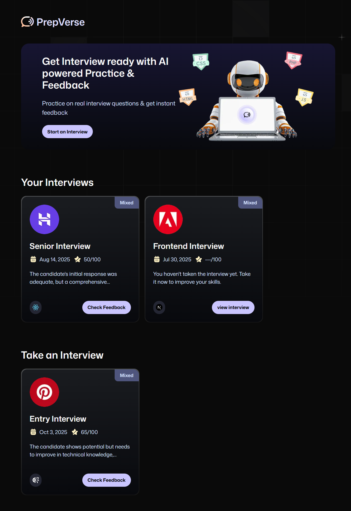
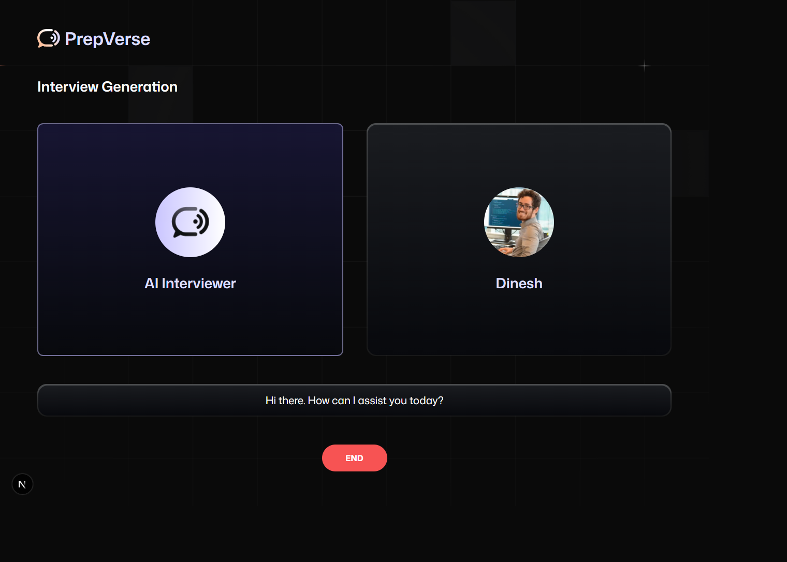
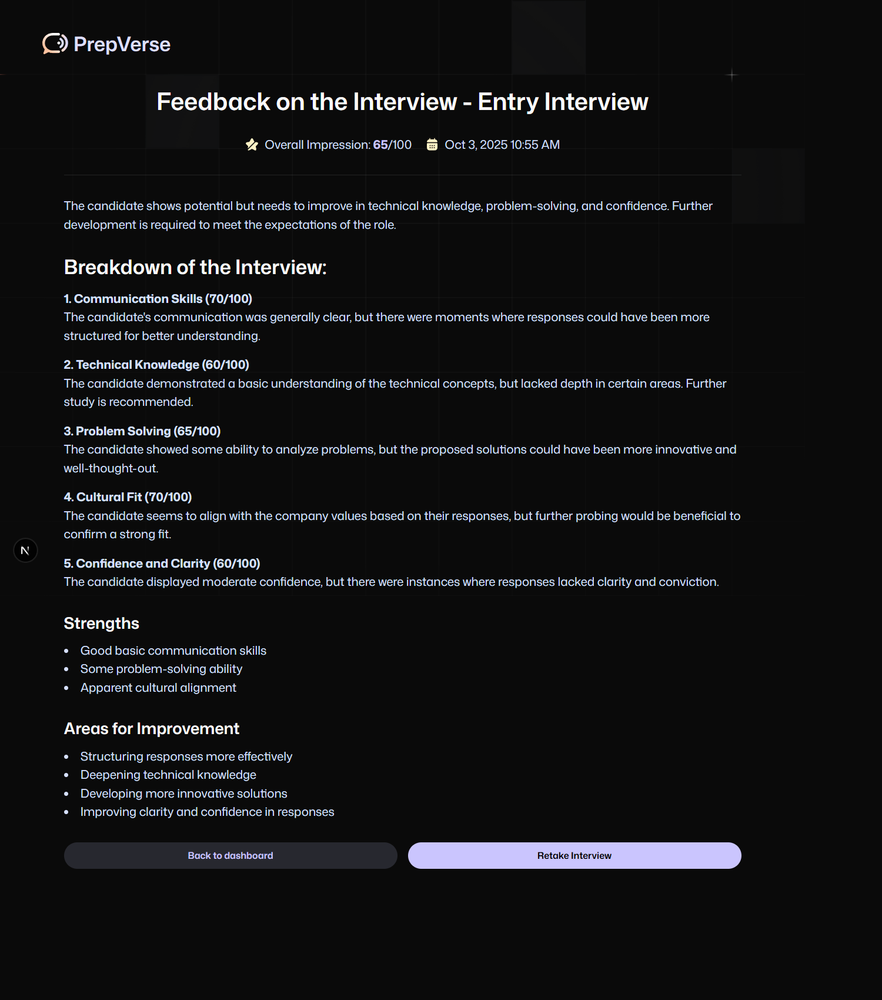

# 🎯 PrepVerse

<div align="center">


**AI-Powered Real-Time Mock Interview Platform**

Practice technical and behavioral interviews with a lifelike AI voice agent that provides instant, actionable feedback.

🌐 **[Live Demo →](https://prep-verse-fko9-git-main-dineshs-projects-e3df0930.vercel.app/)**

[](https://prep-verse-fko9-git-main-dineshs-projects-e3df0930.vercel.app/)
[](https://opensource.org/licenses/MIT)
[](https://nextjs.org/)
[](https://www.typescriptlang.org/)

[View Demo](https://prep-verse-fko9-git-main-dineshs-projects-e3df0930.vercel.app/) · [Report Bug](https://github.com/thedinesh04/PrepVerse/issues) · [Request Feature](https://github.com/thedinesh04/PrepVerse/issues)

</div>

---

## 📋 Table of Contents

- [About The Project](#about-the-project)
- [Key Features](#key-features)
- [Tech Stack](#tech-stack)
- [Screenshots](#screenshots)
- [Getting Started](#getting-started)
- [Project Structure](#project-structure)
- [Roadmap](#roadmap)
- [License](#license)
- [Author](#author)

---

## 🎪 About The Project

PrepVerse is a cutting-edge full-stack application that revolutionizes interview preparation by providing an AI-powered mock interview experience. Built with modern web technologies, it offers real-time voice interaction with an intelligent AI interviewer that adapts to your responses and provides comprehensive feedback.

### Why PrepVerse?

- **🎙️ Real-Time Voice Interaction** - Natural, human-like conversations with <500ms latency
- **🤖 AI-Powered Generation** - Dynamic interview questions tailored to your role, level, and technology
- **📊 Detailed Analytics** - Comprehensive feedback on technical skills, communication, and confidence
- **🔄 Unlimited Practice** - Retake interviews at different difficulty levels anytime
- **📱 Fully Responsive** - Seamless experience across desktop and mobile devices

---

## ✨ Key Features

### 🔐 **Secure Authentication**
- Firebase-powered authentication system
- Secure user registration and login
- Protected routes and session management

### 🎯 **AI Interview Assistant**
- Chat-based interface to specify interview criteria
- Select role, experience level, technology stack, and question type
- Google Gemini AI generates contextually relevant questions

### 🗣️ **Real-Time Voice Agent**
- Powered by Vapi for natural speech interaction
- Emotional intelligence with backchanneling
- Human-like conversational flow
- Voice recognition for seamless responses

### 📈 **Comprehensive Feedback System**
- Detailed performance analysis after each interview
- Identifies knowledge gaps and improvement areas
- Evaluates communication style and confidence
- Technical and cultural fit assessment
- Actionable tips for improvement

### 🎨 **Modern UI/UX**
- Built with Tailwind CSS and Shadcn UI
- Responsive design for all screen sizes
- Accessible components following WCAG guidelines
- Custom design system with cohesive theming

### 📚 **Interview Dashboard**
- Track all past interviews
- Review previous feedback
- Retake interviews with different parameters
- Monitor progress over time

---

## 🛠️ Tech Stack

### **Frontend**
- **[Next.js](https://nextjs.org/)** - React framework with App Router
- **[TypeScript](https://www.typescriptlang.org/)** - Type-safe development
- **[Tailwind CSS](https://tailwindcss.com/)** - Utility-first CSS framework
- **[Shadcn UI](https://ui.shadcn.com/)** - Accessible component library
- **[React Hook Form](https://react-hook-form.com/)** - Form state management
- **[Zod](https://zod.dev/)** - Schema validation
- **[Sonner](https://sonner.emilkowal.ski/)** - Toast notifications

### **Backend & Services**
- **[Firebase](https://firebase.google.com/)** - Authentication & Database
- **[Vapi](https://vapi.ai/)** - Voice API for AI agent
- **[Google Gemini AI](https://deepmind.google/technologies/gemini/)** - Interview question generation

### **Development Tools**
- **Turbo Pack** - Fast bundler for Next.js
- **ESLint** - Code linting
- **Git** - Version control

---

## 📸 Screenshots

<div align="center">

### Home Dashboard


### AI Interview Session


### Feedback & Results


</div>

---

## 🚀 Getting Started

### Prerequisites

- Node.js (v18 or higher)
- npm
- Firebase account
- Vapi API key
- Google Gemini API key

### Installation

1. **Clone the repository**
   ```bash
   git clone https://github.com/thedinesh04/PrepVerse.git
   cd PrepVerse
   ```

2. **Install dependencies**
   ```bash
   npm install
   ```

3. **Set up environment variables**
   
   Create a `.env.local` file in the root directory and add your API keys:
   ```env
   # Firebase Configuration
   NEXT_PUBLIC_FIREBASE_API_KEY=your_firebase_api_key
   NEXT_PUBLIC_FIREBASE_AUTH_DOMAIN=your_firebase_auth_domain
   NEXT_PUBLIC_FIREBASE_PROJECT_ID=your_firebase_project_id
   NEXT_PUBLIC_FIREBASE_STORAGE_BUCKET=your_firebase_storage_bucket
   NEXT_PUBLIC_FIREBASE_MESSAGING_SENDER_ID=your_firebase_messaging_sender_id
   NEXT_PUBLIC_FIREBASE_APP_ID=your_firebase_app_id

   # Vapi Configuration
   NEXT_PUBLIC_VAPI_API_KEY=your_vapi_api_key
   VAPI_PRIVATE_KEY=your_vapi_private_key

   # Google Gemini AI
   GEMINI_API_KEY=your_gemini_api_key
   ```

4. **Run the development server**
   ```bash
   npm run dev
   ```

5. **Open your browser**
   
   Navigate to [http://localhost:3000](http://localhost:3000)

### Building for Production

```bash
npm run build
npm start
```

---

## 📁 Project Structure

```
PrepVerse/
├── app/                      # Next.js App Router
│   ├── (auth)/              # Authentication pages
│   │   ├── sign-in/
│   │   └── sign-up/
│   ├── (root)/              # Main application pages
│   │   ├── dashboard/
│   │   ├── interview/
│   │   └── feedback/
│   ├── api/                 # API routes
│   ├── layout.tsx
│   └── page.tsx
├── components/              # Reusable React components
│   ├── ui/                  # Shadcn UI components
│   └── shared/              # Custom shared components
├── lib/                     # Utility functions and configs
│   ├── firebase.ts
│   ├── vapi.ts
│   └── utils.ts
├── types/                   # TypeScript type definitions
├── constants/               # Application constants
├── public/                  # Static assets
│   ├── icons/
│   ├── images/
│   └── screenshots/
├── styles/                  # Global styles
│   └── globals.css
└── package.json
```

---

## 🗺️ Roadmap

### Planned Features

- [ ] **Multi-language Support** - Support for interviews in multiple languages
- [ ] **Video Recording** - Record interview sessions for later review
- [ ] **AI Resume Analysis** - Upload resume for personalized interview questions
- [ ] **Interview Analytics Dashboard** - Advanced metrics and progress tracking
- [ ] **Peer Mock Interviews** - Connect with other users for peer practice
- [ ] **Interview Templates** - Pre-built templates for different companies
- [ ] **Calendar Integration** - Schedule practice sessions
- [ ] **Mobile App** - Native iOS and Android applications
- [ ] **Team Accounts** - Organizations can create team accounts for batch practice
- [ ] **Advanced AI Feedback** - Sentiment analysis and body language tips (with video)

### Known Limitations

- Voice recognition requires stable internet connection
- Currently supports English language only
- Limited to technical and behavioral interviews (no coding challenges yet)

---

## 📄 License

Distributed under the MIT License. See `LICENSE` for more information.

---

## 👨‍💻 Author

**Dinesh**

- GitHub: [@thedinesh04](https://github.com/thedinesh04)

---

## 🙏 Acknowledgments

- [Next.js Documentation](https://nextjs.org/docs)
- [Vapi AI Platform](https://vapi.ai/)
- [Google Gemini AI](https://deepmind.google/technologies/gemini/)
- [Shadcn UI](https://ui.shadcn.com/)
- [Firebase](https://firebase.google.com/)

---

<div align="center">

### ⭐ Star this repository if you find it helpful!

Made with ❤️ by [Dinesh](https://github.com/thedinesh04)

</div>
